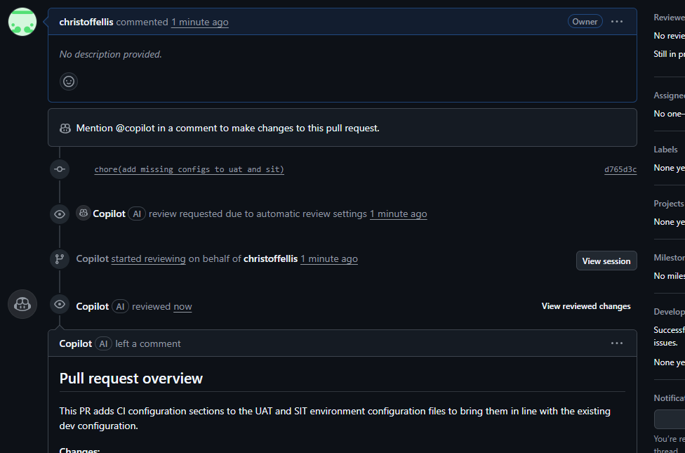

# Testing GH Copilot to catch erroneous config updates

A basic readme was generated and put in `.github/copilot-instructions.md` to guide Copilot in deciding when something could potentially be bad for configs, ie:
 - Updating something that shouldnt have been
 - A value that is for a different env
 - Something that may be useful to put in UAT but wouldnt make sense for dev

## Response time

Illustraded is a response generated less than a minute after the PR was created (this is running on my personal account, so public runners were used).
 
[Link to PR](https://github.com/christoffellis/test-copilot-repo/pull/3)

## Adding a new env

In another test, a new env was added, with only half the values were updated. 

[Link to PR](https://github.com/christoffellis/test-copilot-repo/pull/4)